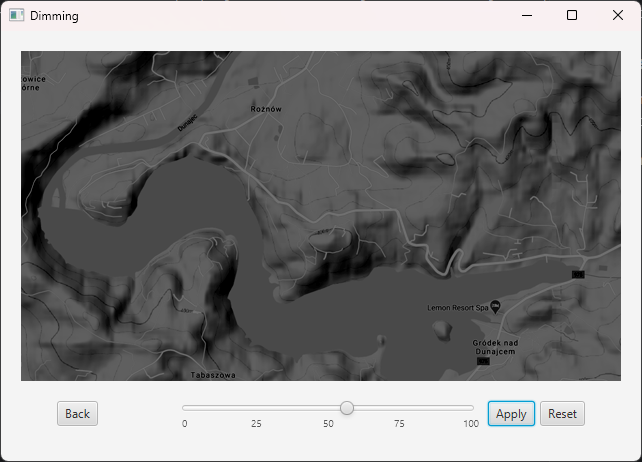
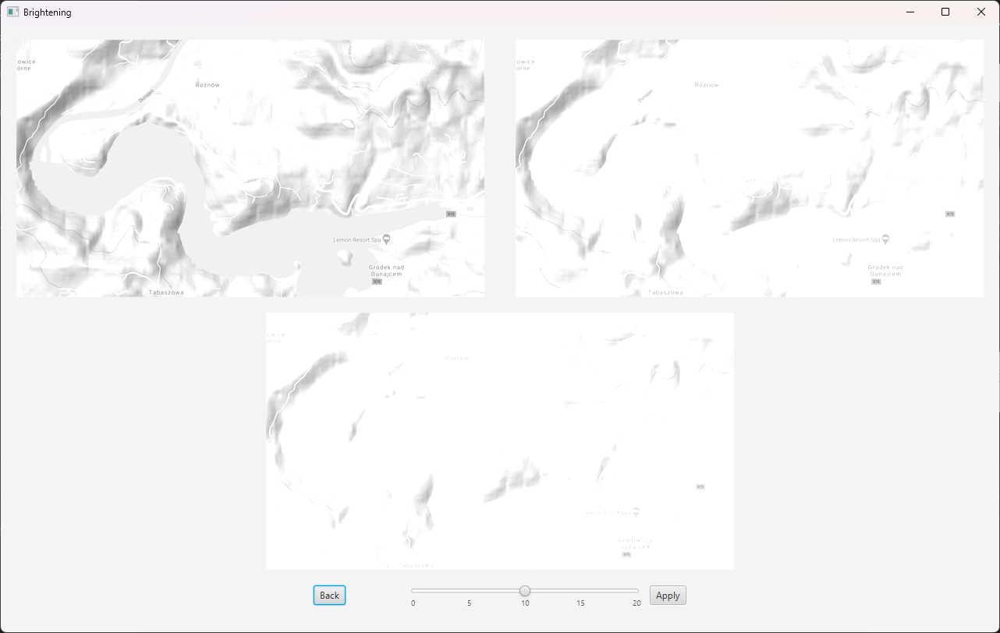
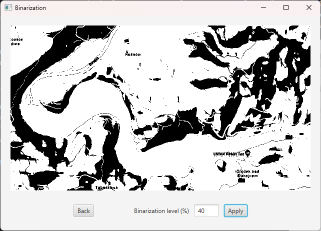

# Image editing application
This application lets you dim, brighten and binarize your image.

### Overview
Application uses JavaFX for displaying content and Image class for image manipulation.
All operations are done on raw data. Image conversion is done with SwingToFXUtils.
All resulting images are saved in output folder.

* Dimming - darken your photo with just one click!
Pick darkness level with a slider et voilà!
If you don't like the result, just try again.

* Brightening - want to brighten your photo, but don't know by how much?
Here comes the rescue!
This module produces three images with growing brightness levels each.
Now you can see whichever one feels best for you!

* Binarization - determine brightness cutoffs levels with ease!
Check which value lets you detect differences between objects.

