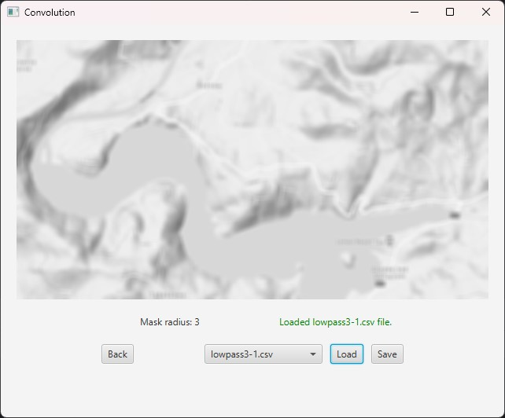
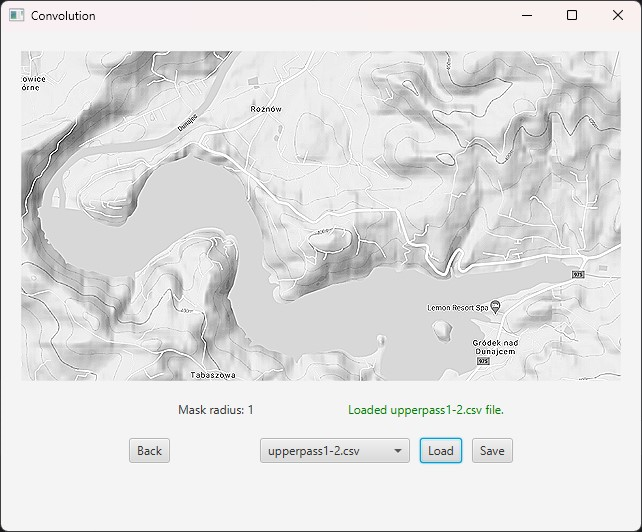
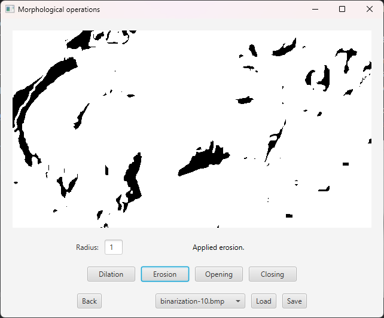
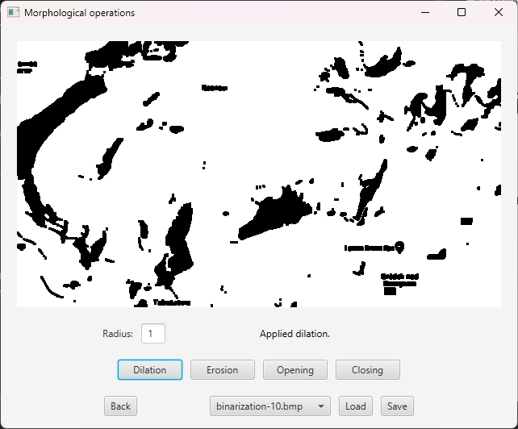
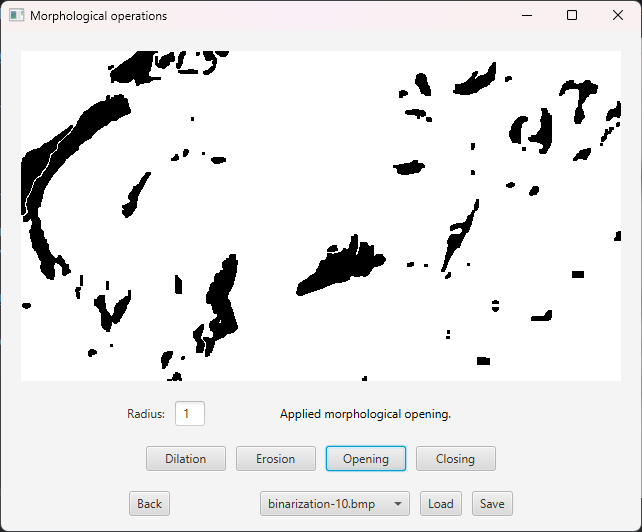
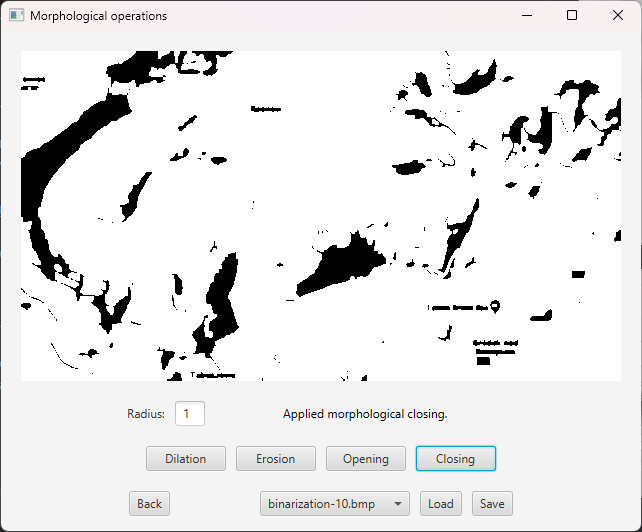

# Image editing application

Simple solution for applying masks on images and altering binarized photos.

### Overview
Application uses JavaFX for displaying content and Image class for image manipulation.
All operations are done on raw data. Image conversion is done with SwingToFXUtils.
Resulting images can be saved to output folder.

* Convolution - sharpen and blur your photo with one of pre-defined masks.
Want to apply other operation? Insert your mask in the 'masks' folder and enjoy the results.

* Erosion - shrink all the black spots you can see in your photo.

* Dilation - maybe you want it the other way around?
It's all bulkier now.

* Morphological opening - remove artifacts but nothing else!
Keep what's interesting in your image and smooth sharp edges out.

* Morphological closing - make it seem like you used a little too much ink.
See what you couldn't spot, some grains are bigger now!

