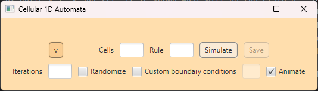
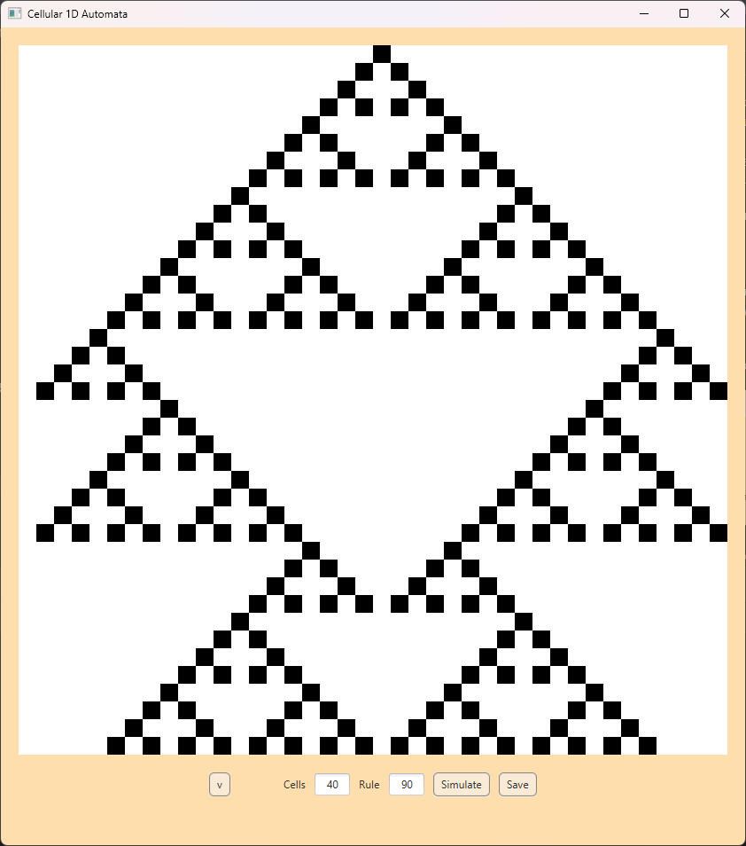
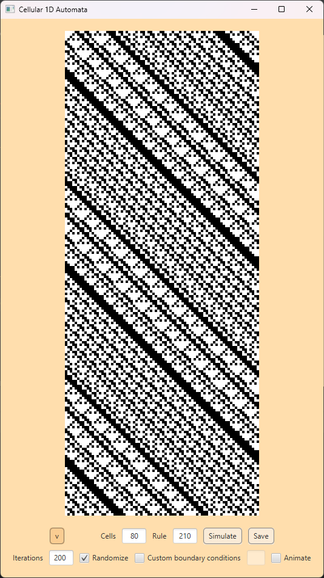

# 1D Cellular Automata
1D Cellular Automata is a JavaFX program for simulating cellular automata in one dimension.

### What is a cellular automata?
Cellular automata is a discrete computation model.
It consists of grid of cells (automatons), finite number of states and evolution rule.
In the simplest model, automaton can take only one of two states
(1 and 0, black and white etc.) at a given instance of time.
It's state in next instance of time can be deduced with a _rule_.
Rule is defined for an automaton and is based on its neighbourhood.
Given the states of cells x-1, x and x+1, it is known what will be the state of x in next iteration.

More info about cellular automata can be found [here](https://en.wikipedia.org/wiki/Elementary_cellular_automaton).

### Program usage
By default, user has to input number of cells and rule number only.
Clicking simulate will present animated evolution of CA with only it's middle cell set to black.
Boundary conditions are both set to white.

User can change simulation parameters by accessing extra menu with button to the left.

From here, user can set total number of iterations, choose if domain should be randomized,
set custom boundary conditions and toggle animation, if they're interested in results only.

After the animation is complete, user can save simulation data to a .csv file.

### Examples
40 cells, rule #90.

80 cells, rule #210 (200 iterations, randomized domain).

